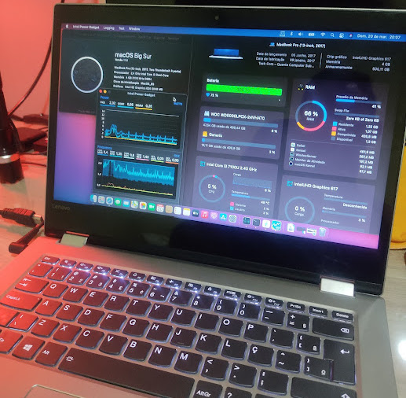
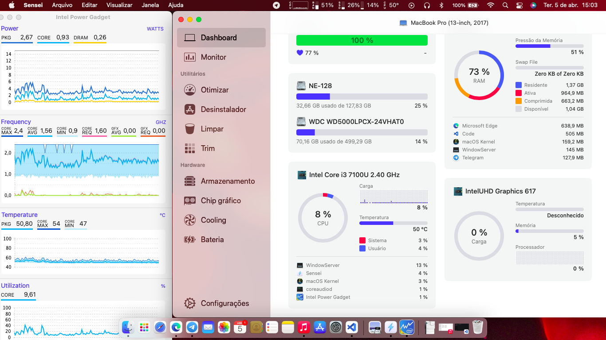
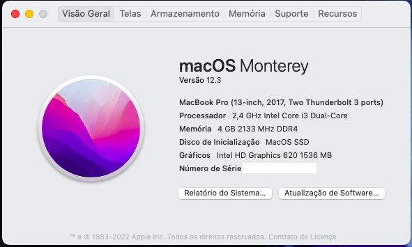
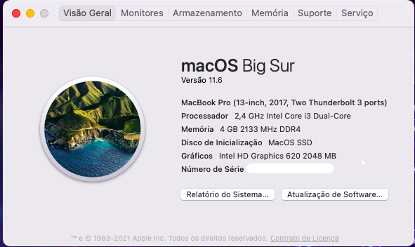

<h1 align="center"> EFI Lenovo Yoga 520-14IKB Intel-core i3 7100U </h1>
<h3 align="center"> Hackintosh EFI partition with support for macOS </h3>

# Donate PayPal - I scan the QRcode below and give any value.

<h3 align="center">Help maintain this project. Thank you 🍺  
<a href="mailto:ricardos7@hotmail.com">ricardos7@hotmail.com</a>
</h3>

<form action="https://www.paypal.com/donate" method="post" target="_top" align="center">
<input type="hidden" name="hosted_button_id" value="Z4V3GZF3ACE84" />
<input type="image" src="https://www.paypalobjects.com/en_US/i/btn/btn_donateCC_LG.gif" border="0" name="submit" title="PayPal - The safer, easier way to pay online!" alt="Donate with PayPal button" />

</form>

# Doações por PIX - leia o QRcode abaixo e doe qualquer valor.
<h3 align="center">Ajude a manter esse projeto. Obrigado 🍺 </h3>

# Characteristics
- Screen: 14 inches with HD resolution (1366 x 768 pixels) and touch sensitive,
- Processor: Core i3 7100U,
- RAM memory: 4 GB,
- Graphics Card: Intel HD Graphics 620,
- Storage: HD 500 GB, SSD 128 GB
- Ports and Interfaces: USB 3.0, USB-C, HDMI, headphone jack, Bluetooth and Wi-Fi, memory card reader,
- Dimensions: 33 x 23.5 x 1.9 cm,
- Weight: 1.74 kilos

# It works
- Keyboard with lighting and shortcuts for brightness and volume.
- touchpad with gestures.
- wifi (has been replaced by an Intel 7265)
- usb 3.0 e USB type-C.
- battery indicator.
- intel UHD 620 graphics card with 1.5 gigas.
- webcam.
- card Reader.
- audio (see layout id files).
- HDMI connection (video and audio).
- brightness control keys f11 e f12. 
- volume control.
- touch screen.
- connect audio jack with microphone. 
- power control.
- sleep e auto sleep.

# Doesn't work

- Fingerprint reader.
- Native wifi (has been replaced by an Intel 7265) -  Recommend DW1560 - BCM94360NG (plug and play).

# Screenshot 
 

 

# Updade MacOS Monterey 12.6

<h3>Update 30/04/2022</h3>

- Fixed video patch that didn't enable audio and video on HDMI
- the config.plist file has been replaced with the fix and the old one has been renamed to configOLD.plist if it is still useful in the future, but it can be removed from the folder without any problem in your hackintosh.

<h3>Update 19/04/2022</h3>

- Upadate ACPI DSDT, touchpad precision correction.
- Improved power management.
- Added kext yogaSMC.kext to activate secondary keys from F4 to F10 keys. <a href="https://github.com/zhen-zen/YogaSMC"> see installation instructions.</a>

<h3>Update 04/04/2022</h3>

- Added folder EFI OC version 0.8 Mod-no-acpi monterey 
- You can now boot windows through the opencore interface without problems, because oc acpi files are not injected into windows.
- All kexts updated until
- Fix quirks in config file
- Removed patch that showed 2 Gb of video memory as it was purely aesthetic.
- Added theme BsxImacGreen as standard

# Update MacOS Big Sur 11.6

<h3>Update 04/04/2022</h3>

- Updated KEXTS Folder OC 0.7.8 Big Sur

# Bugs
- When turning on MacOS, sometimes the keyboard and mouse do not work on the OC screen until you enter windows and exit or reset nvram.
- One way around this is by selecting the Mac partition and typing Ctrl + Enter to always start on it by default, and when using Windows, press the f12 or Fn + F12 key and choose the windows boot partition if it is on a disk different from mac.
- If the two systems tverem on the same disk a solution can be shut down using the power button or use an external mouse or keyboard, I can not describe this situation well since my systems are on different disks.

# Heads up
* see id layout tests to enable headphone output microphone (jack connector)

# Bonus
- 2 Themas, 

<h3>how to install themes!</h3>

- Delete the Resources and Tools folders inside the EFI - OC folder and replace them with the ones inside the themes file.

# Disclaimer
The hackintosh process is a relatively simple process, but 
there is always the risk of you damaging your device, here 
I am making available the files and procedure I used under 
"My equipment", I am not responsible for any misuse or wrong 
by whoever it is. The files are free to use, but not i will 
be responsible for any damage that you may cause on your 
equipment, the only one responsible will be you, who is who 
is performing the procedure, in this way, do at your own risk.

# Credits
 - <a href="https://github.com/Ricardo-SS"> Ricardo-SS </a>
 - <a href="https://github.com/acidanthera"> Acidanthera </a>
 - <a href="https://github.com/dortania"> Dortania </a>
 - <a href="https://bitbucket.org/RehabMan/"> Rehabman </a>
 - <a href="https://www.olarila.com/profile/2-mald0n/"> MaLd0n </a>
 - <a href="https://github.com/OpenIntelWireless"> OpenIntelWireless </a>
 - <a href="https://github.com/zhen-zen"> zhen-zen </a>
 - <a href="#"> And others </a>